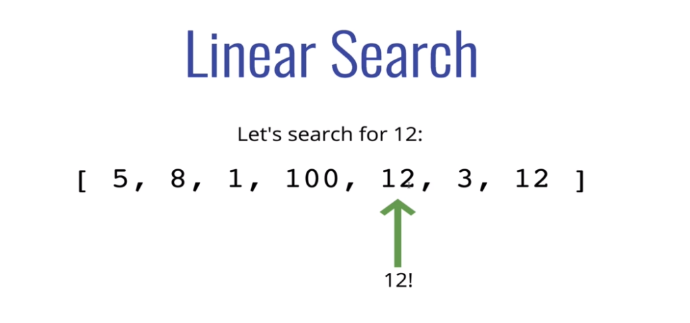
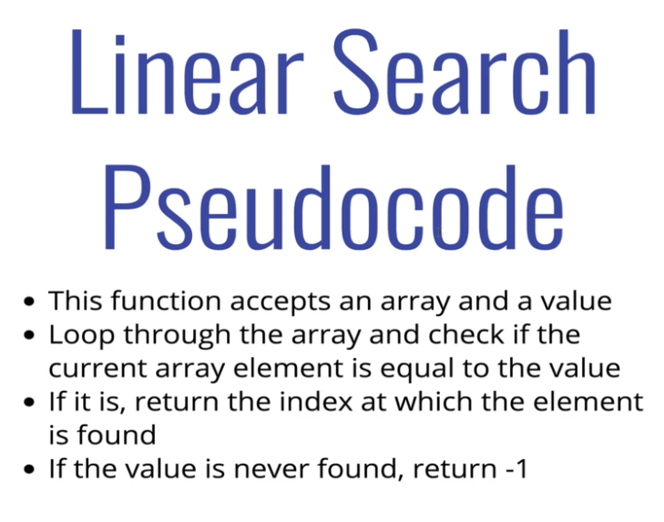

## The Big Google Algo

When we talk of Searching Algorithms, One of the Very few things that will come to your mind is the google search. Just to Serve your curiousity , Google Search Algorithim is very complex because a lots of commands are being ran and lots of specific consideratins are being made before search results pop up and also in no time. Some of the Complex algorithm being used includes

### 1 . Graphs

### 2. Trees , e.t.c

## Linear Search

### How do we Search ?

Some of the prevalent ways of searching through an Array of data is going through each elements one by one till we get to the one we are looking for .
This type of Approach is termed Linear Search and is mostly done on unsorted data.

### Spoiler Alert : Javscript Do have a Search and it is unsuprisingly Linear !

### Some of the Built in JS Linear Algorithm includes

##### 1. indexOf

##### 2. includes

##### 3. find

##### 4. findIndex

### Example below

### Linear Search Challenge

